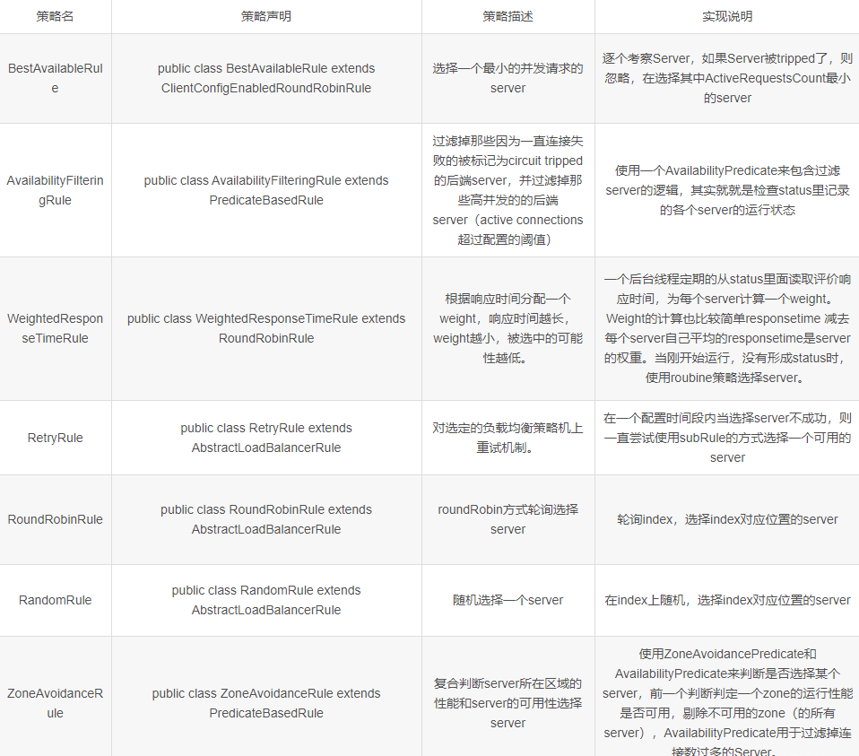

## Ribbon负载均衡

经过对Eureka的认识，及Eureka集群的搭建，已经基本可以入门Eureka的使用。之前对于服务调用者我们是直接获取注册列表后通过 get(0) 的方式来获取第一个注册信息。而当我们服务提供者也搭建了集群之后。这种方式是不可取的。那么**如何选择一个合适的提供者来提供服务呢？**

首先排除我们自己通过硬编码的方式选。

之前接触过Zookeeper的朋友应该对负载均衡这个词不陌生，而Ribbon是另外的一种负载均衡程序，和Eureka同为NetFlix公司开发，且在Eureka客户端中集成了Ribbon。一般搭配使用。

### Ribbon的主要作用

#### 服务调用

基础Ribbon实现的服务调用，是通过拉取到所有的服务列表组成(服务名+请求路径)映射关系，借助RestTemplate实现调用。

##### 注意：

在使用 Ribbon 进行服务调用的时候，**应用的名称只能使用 - 中划线连接**，不能使用下划线。否则服务将无法识别。

1. 在注入RestTemplate的同时加上 @LoadBalanced 注解

```java
@Bean
@LoadBalanced
public RestTemplate restTemplate(){
    return new RestTemplate();
}
```

2. 服务调用的时候，不用再去手动的从列表中获取服务的请求url，直接使用服务名称替代之

```java
@GetMapping("teacher/users")
public List getAllUser(){
return restTemplate.getForObject("http://SERVICE-PROVIDER/api/v1/users", List.class);
}
```

#### 负载均衡

根据其内置的负载均衡算法，在有多个服务提供方时，选择合适的一个。Ribbon提供的负载均衡算法有：



可通过配置直接修改：

```yml
# 可以通过 服务名：ribbon:NFLoadBalancerRuleClassName: 对应的策略全类名
SERVICE-PROVIDER:
  ribbon:
    NFLoadBalancerRuleClassName: com.netflix.loadbalancer.WeightedResponseTimeRule
```

#### 重试机制

除了服务调用和负载均衡，Ribbon家族还提供了允许接口调用时重试。使用方法如下：

1. 导入重试坐标

```xml
<dependency>
    <groupId>org.springframework.retry</groupId>
    <artifactId>spring-retry</artifactId>
</dependency>
```

2. 在配置文件中配置相应的参数

```yml
spring:
  cloud:
    loadbalancer:
      retry:
        enabled: true # 重试功能的开关 默认 true
SERVICE-PROVIDER:
  ribbon:
    ConnectTimeout: 250 # 与服务提供方建立Http连接的超时时间
    ReadTimeout: 1000 # 接收返回数据的超时时间
    OkToRetryOnAllOperations: true # 是否对所有操作都进行重试
    MaxAutoRetriesNextServer: 1 # 切换实例的重试次数
    MaxAutoRetries: 1 # 对当前实例的重试次数(包含第一次请求，即配置1相当于请求超时就切换)
```

如果按照上面的配置，当消费方向提供方尝试建立连接后250ms未能成功，就会直接切换至下一个服务方尝试连接(autoRetries = MaxAutoRetries = 1)。此时如果还失败(autoRetriesNextServer = MaxAutoRetriesNextServer = 1)，则请求失败。可以根据业务需求进行实际的配置